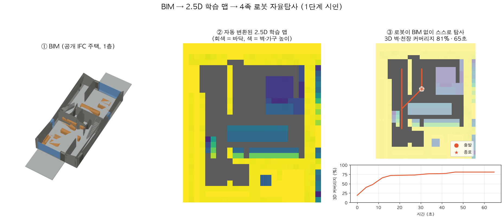
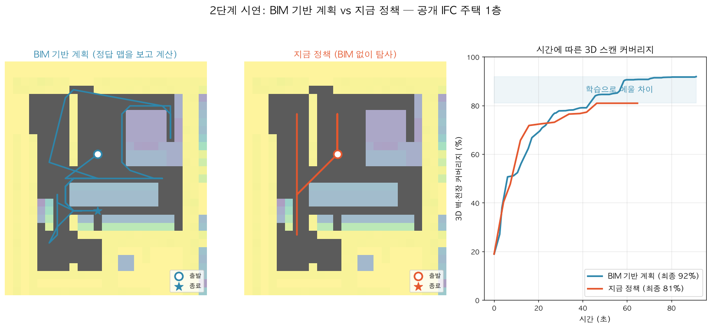

# 3DOG: BIM으로 배우고, BIM 없이 스캔한다

4족보행 로봇(Unitree Go2 + VLP-16)이 처음 보는 건물을 **BIM 없이** 스스로 탐사하며 3D 스캔을 완성하도록, **BIM 기반 최적 계획을 따라 배우는** 탐사 정책을 만든다.

- 팀 메인 레포: [gkgk0119gmail-arch/3DOG_Go2-exploration](https://github.com/gkgk0119gmail-arch/3DOG_Go2-exploration) (Isaac Sim, Go2 보행, ARiADNE 재학습)
- 이 저장소: 메인 레포 위에 얹는 **BIM 관련 추가분** (1단계 완료, 2단계 시연)
- 연구 목표 정리 문서: [docs/3DOG_연구목표_정리.docx](docs/3DOG_연구목표_정리.docx)

## 왜 이 연구인가

연구실의 BIM 기반 스캔 계획([Park et al., AutCon 2023](https://doi.org/10.1016/j.autcon.2023.104911))은 숙련 측량사보다 효율적이지만 **현장마다 그 건물의 BIM이 필요**하다. BIM이 없는 건물(노후 건물, 리모델링)이나 BIM과 다른 현장(자재, 가설물)에서는 쓰기 어렵다.

| 기존 연구 | 한계 | 우리 |
|---|---|---|
| BIM 기반 스캔 계획, BIM 내비게이션 | 현장에서 BIM 필요 | **BIM은 학습에만**, 현장에서는 라이다만 |
| 강화학습 탐사 (ARiADNE, HEADER 등) | 2D 지도만 채움 | **3D 벽·천장 스캔** |
| 시간 효율 탐사 (GRATE) | 회전을 학습 후 보정 | **4족 회전 시간을 학습에 반영** |

## 핵심 아이디어

| | BIM 기반 최적 계획 | 탐사 정책 (우리가 학습) |
|---|---|---|
| 보는 것 | 건물 전체 BIM (정답) | 라이다로 지금까지 본 것 |
| 하는 일 | 최적 스캔 경로 계산 | 다음에 갈 곳 선택 |
| 쓰는 때 | 학습할 때만 | 학습 + 실제 탐사 |

학습 중에 탐사 정책의 선택이 최적 경로의 다음 지점에 가까울수록 보상을 준다([HEADER, 2025](https://arxiv.org/abs/2510.15679) 방식). 최적 경로의 비용은 Go2의 회전 포함 이동 시간, 목표는 3D 벽·천장 커버리지다.

## 데이터 역할

| 데이터 | 역할 |
|---|---|
| 절차 생성 맵 (수천 개) | 학습 (양의 대부분) |
| 공개 BIM · 공개 3D 실내 데이터 · 연구실 다른 BIM | 학습 |
| **교수님 백양누리 BIM** | **시험** (학습에 쓰지 않음) |
| 창고 · 사무실 · 건설현장 Isaac Sim 환경 | 추가 시험 |

## 단계별 계획

| 단계 | 내용 | 어디서 | 과목 | 상태 |
|---|---|---|---|---|
| 1 | BIM → 2.5D 학습 맵 변환 | Python | 사기설 | **완료** |
| 2 | BIM 기반 최적 계획을 따라 탐사 정책 학습 | 2.5D 환경 (Python) | 사기설 | **계획 시연까지** |
| 3 | 백양누리 BIM → Isaac Sim 구축 | Isaac Sim | 사기설 | 예정 |
| 4 | Isaac Sim 백양누리에서 시험 | Isaac Sim | 사기설 | 예정 |
| 5 | 다른 환경에서 일반화 확인 | Isaac Sim | 사기설 | 예정 |
| 6 | 실제 백양누리에서 Go2 실증 | 실제 로봇 | PRAXIS | 예정 |

### 1. BIM → 2.5D 학습 맵 변환 (완료)

2.5D 맵은 0.4 m 격자에 칸마다 장애물 높이와 천장 높이를 붙인 지도다. 라이다가 벽·천장을 얼마나 보는지 빠르게 계산할 수 있다.

- 한 층을 잘라 벽·기둥·가구를 격자에 투영하고, 바닥에서 0.05~0.7 m 높이에 무언가 있으면 막힌 칸으로 본다.
- 문은 열린 것으로 처리하고, 바닥과 천장이 모두 있는 칸만 실내로 본다. 떨어진 세대는 따로 저장한다.
- 결과: 공개 IFC 3개 → 맵 11장 ([figures/maps/](figures/maps/)).

### 2. 탐사 정책 학습 (계획 시연까지)

맵마다 BIM으로 최적 스캔 경로를 계산하고, 탐사 정책이 라이다로 본 것만으로 그 경로를 따라 가도록 학습한다.

- 2.5D 학습에서 로봇은 3D 모델이 아니라 **점 + Go2 이동 시간 공식**(회전 1.5 rad/s, 보행 1.0 m/s)이다. 그래서 수천 번 반복할 수 있다.
- 보행은 메인 레포에서 Isaac Lab PPO로 이미 학습했다.
- 지금까지: BIM 기반 계획 코드(`bim_expert.py`)와 비교 시연. 남은 것: 새 보상 구현과 실제 학습(Ubuntu 학습 PC, 수 시간).

### 3. 백양누리 BIM → Isaac Sim 구축 (예정)

IFC → 3D 메시 → Isaac Sim(USD)으로 옮겨 가상 건물을 만든다.

- 설정: 단위(mm→m), 충돌, 문 열기, 유리 확인, 시험 구역 밖 막기
- 정답: 2D 점유 지도, 3D 표면 정답, BIM 기반 계획 결과(상한선)
- 시험 구역은 실제 실증 구역과 같게 정한다.

### 4. Isaac Sim 백양누리에서 시험 (예정)

Go2 3D 모델(학습된 보행) + 학습된 탐사 정책이 BIM 없이 탐사한다.

| 비교 대상 | 역할 |
|---|---|
| BIM 기반 최적 계획 | 상한선 |
| frontier 탐사 | 기존 고전 방법 |
| 원본 ARiADNE · 1차 재학습 정책 | 기존 학습 방법 · 이전 단계 |

- 조건 ① BIM 그대로: 상한선에 얼마나 가까운가
- 조건 ② BIM에 없는 장애물 추가: BIM 기반 계획보다 강건한가

### 5. 다른 환경에서 일반화 확인 (예정)

같은 비교를 학습에 안 쓴 2.5D 맵 60장, NVIDIA 창고, 사무실 등 기본 환경, 공개 IFC 건물, 건설현장 디지털트윈에서 반복한다. 모든 환경에서 순위가 같으면 성공이다.

### 6. 실제 백양누리 실증 (PRAXIS, 예정)

실제 Go2 + VLP-16(15° 마운트) + Jetson Orin NX로 같은 구역을 BIM 없이 탐사한다.

- 정답: 연구실 TLS 스캔
- 비교: TLS 대비 커버리지·오차, 4단계 시뮬레이션 결과와 비교(sim-to-real)
- 준비: Go2 구입, SLAM 연동, 마운트 제작, 안전교육

## 성공 기준

- **핵심 지표:** BIM 기반 계획 대비 3D 스캔 완료 시간 격차 (목표 15% 이내, 베이스라인 측정 후 확정)
- **추가:** BIM에 없는 장애물이 있어도 잘 되는가, frontier · 원본 ARiADNE보다 빠른가

## 시연 (공개 BIM)

**1단계: BIM → 2.5D 학습 맵 → 탐사** (기존 정책이 BIM 맵에서 그대로 동작, 3D 81%, 65초)



**2단계: BIM 기반 계획 vs 지금 정책** — 지금 정책은 3D 81%에서 멈추고, BIM을 아는 계획은 92%까지 찍는다. 이 차이를 학습으로 메우는 것이 목표다.



| | BIM 기반 계획 | 지금 정책 |
|---|---|---|
| 최종 3D 커버리지 | 92% | 81% |
| 80% 도달 시간 | 43초 | 46초 |

공개 BIM 캡처: [figures/bim_captures/](figures/bim_captures/)

## 파일

| 경로 | 내용 |
|---|---|
| `tools/bim_to_25d.py` | IFC 한 층 → 2.5D 맵(`.npz`) + 미리보기 |
| `ariadne3d/bim_env.py` | BIM 맵 학습 환경 (`--world bim`) |
| `ariadne3d/bim_expert.py` | BIM 기반 계획 (정답 맵을 보고 계산하는 상한선) |
| `patches/3DOG_Go2-exploration.patch` | 메인 레포에 위 파일 + `driver3d.py`·`eval3d.py`의 `--world bim` 옵션을 한 번에 적용 |
| `maps_bim/` | 변환된 맵 11장 |
| `docs/` | 연구 목표 정리 문서 |

## 사용법 (메인 레포에서)

```bash
cd 3DOG_Go2-exploration
git apply ../3DOG-bim-demo/patches/3DOG_Go2-exploration.patch
pip install ifcopenshell

python tools/bim_to_25d.py model.ifc ariadne3d/maps_bim
cd ariadne3d && mkdir -p gifs/go2_turn_3d
python eval3d.py ../weights/ariadne3d_go2_turn_3d_ep4000_policy.pth --world bim --n 11 --node_res 2
```

## 사용한 공개 IFC

IFC 원본은 저장소에 넣지 않았다. 아래에서 받는다. 모두 소프트웨어 테스트용 공개 파일이라, 학습·논문에 쓰기 전 이용 조건을 확인해야 한다.

| 건물 | 출처 |
|---|---|
| Duplex (2층 주택) | [youshengCode/IfcSampleFiles](https://github.com/youshengCode/IfcSampleFiles) `Ifc2x3_Duplex_Architecture.ifc` |
| Dental clinic (2층 치과) | [ThatOpen/web-ifc](https://github.com/ThatOpen/web-ifc) `tests/ifcfiles/public/dental_clinic.ifc` |
| DigitalHub (사무, 지하 포함) | [ThatOpen/web-ifc](https://github.com/ThatOpen/web-ifc) `tests/ifcfiles/public/FM_ARC_DigitalHub.ifc` |

## 한계 (현재)

- 2.5D라서 칸마다 높이가 하나다. 문 위 인방·보, 계단·다층은 표현하지 못한다.
- BIM 기반 계획은 단순 그리디라 진짜 최적은 아니다. 큰 맵에서는 경로가 지나치게 길어진다.
- 좁은 문(약 1 m)이 많은 건물에서는 탐사 그래프 노드 간격(2~4 m) 때문에 탐사가 일찍 멈추는 경우가 있다.
- ARiADNE 원본 코드의 라이선스 표기가 없어 메인 레포 공개 전 확인이 필요하다.

## 확인할 것

- [ ] 연구실에 백양누리 BIM, TLS 정답 데이터, BIM 스캔 계획 코드가 있는지
- [ ] 백양누리 BIM(IFC) → Isaac Sim 변환 시험
- [ ] 공개 데이터 라이선스
- [ ] frontier 베이스라인 측정 후 목표 수치 확정
